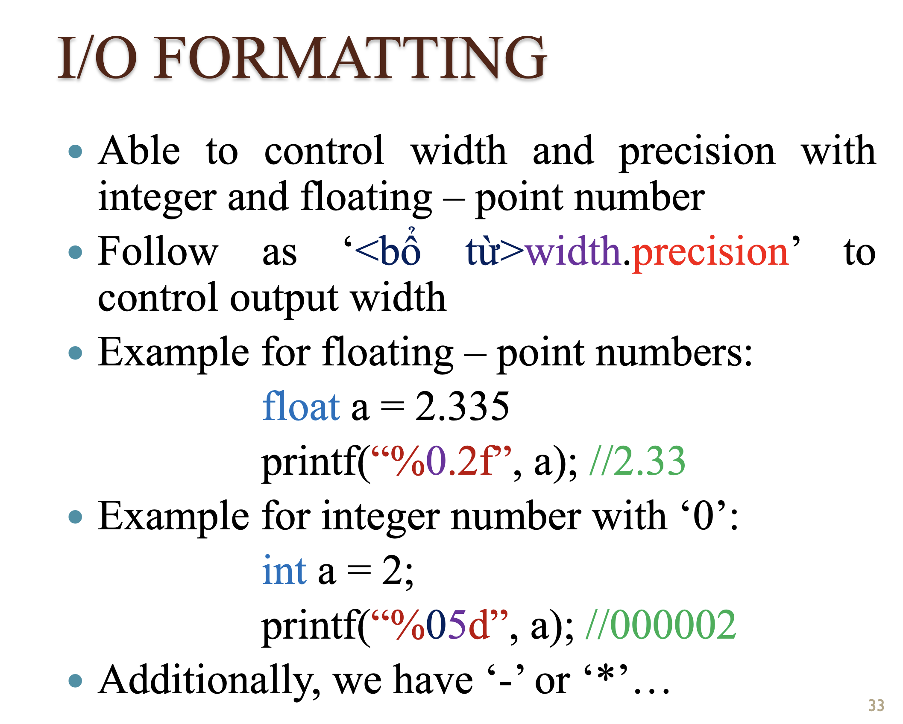

# MSc_S4_ProgrammingTechniques

## Intro.
- Làm bài tập nhóm hằng tuần - tối đa 2 bạn/nhóm
- Thi cá nhân: Trắc nghiệm - 80->100 câu
- Liên hệ với giảng viên qua moodle message (forum)
- Không cần làm đồ án

Có 10 buổi:
- 5 buổi cơ bản
- 5 buổi nâng cao

Môi trường lập trình cần đồng nhất để giảng viên dễ chấm bài:
- Visual Studio 2022

Mục đích:
- Cần nhanh -> dùng C/C++

Sách tham khảo (bắt buộc phải có):
- Nhập môn lập trình - Mr. Thư
- Kỹ thuật lập trình - Mr. Thư
- The C++ programming language - Bjame Stroustrup
- Intro. to algo - Thomas H.

Nội dung
- Tổng quan
- Toán tử cơ bản
- cấu trúc điều khiển - if else
- lập trình đơn thể - modular programming
- thuật toán cơ bản
- lập trình điều kiện
- mảng
- kỹ thuật loop
- struct - kiểu dữ liệu gộp
- xử lí file - text, binary

Program
- là tập hợp/chuỗi các chỉ dẫn
- để giải quyết một bài toán

Có 2 loại chương trình
- mã máy (machine code) (01)
- hợp ngữ (assembly, assembler) - thường dùng trong lập trình nhúng


Quá trình của mã máy:
người dùng -> run -> hệ điều hành -> tìm -> chương trình -> load -> ram -> xử lí -> chip
- tuỳ thuộc vào cpu
- tuỳ thuộc vào hệ điều hành
- khó hiểu

Hợp ngữ
- là ngôn ngữ lập trình cấp thấp
- dễ hiểu hơn mã máy
- cần trình biên dịch (assembler)
- phụ thuộc vào cpu
- tận dụng được kiến trúc cpu nhưng phải viết và dùng đúng cho cpu đó, loại khác thì phải viết lại

ngôn ngữ lập trình cấp cao truyền thống (C/C++)
- dễ hiểu hơn hợp ngữ
- tương thích tốt hơn
- trừu tượng hơn hợp ngữ
- viết một lần, dùng khác compiler để đọc cho các hệ điều hành khác nhau

Mục tiêu của các ngôn ngữ lập trình:
- hệ điều hành: C/C++
- máy học: python
- tính toán khoa học: fortran
- hệ thống quản lí: java, c#

ngôn ngữ lập trình cấp cao hiện đại (java)

code -> compiler -> byte-code -> virtual machine -> chip

- có xu hướng dịch ra byte-code

Compiler
- nhiệm vụ: biên dịch code và lưu kết quả đã biên dịch lên ổ cứng
- phải đủ code mới biên dịch dc

Interpreter
- trình thông dịch
- thông dịch từng dòng

C: .c -> compiler -> .o -> connect by linker
C++: .cpp -> compiler -> .obj -> connect by linker


IDE: Visual Studio 2022

Ví dụ:


%d gọi là mã định dạng

&a là địa chỉ của a

printf -> printf_s

scanf -> scanf_s

C: <math.h> -> dùng double (tập IR)

%lf là định dạng double

C++: <cmath>


Có thể lỗi do người dùng nhập b=0

Nộp file: TenHV1_TenHV2.cpp

COUT << "Hello World";
    - << là toán tử nhận 2 tham số:
        1. chuỗi (Hello World)
        2. COUT là biến, biến này kết nối với thiết bị xuất (ví dụ: màn hình) để đổ dữ liệu lên

Tương tự với CIN >> a;

\n: xuống dòng và thụt vào đầu dòng, tương tự với endl;

Kiểu dữ liệu


- đoạn code của mình sẽ được chứa vào vùng TEXT
- initualized data và uninitualized data là vùng nhớ cố định, chứa biến toàn cục 
- heap - có thể co dãn
- stack - có thể co dãn

câu lệnh define trong c không có dấu chấm phẩy: #define PI 3.14


Quy tắc đặt tên biến: 
- từ A -> Z, underscore
- quy tắc chung
- không dấu
- không khoảng trắng
- không kí tự đặc biệt

giới thiệu toán tử sizeof:
- sizeof(int) (=4 bytes)
- sizeof(c)

Lưu đồ
- UML


chú ý: unsigned char = 256 (= 256 mod 256 = 0)


 
chú ý tràn số vì nó tự động mod


ý tưởng lưu trữ số âm, nhưng xu là số 0 có 2 cách lưu trữ =))

người ta phát triển cách khác để lưu trữ số âm, đó là bù 2


thao tác bit: &, |,

shift left: << -- tác dụng nhân 2 --> tốc độ nhanh hơn

shift right: >> -- tác dụng: chia 2 --> tốc độ nhanh hơn

trong C không hỗ trợ rotate

Một số trường hợp gán ngoài vùng giá trị, thường không báo lỗi nên ta cần chú ý -> cần kiểm soát tốt vùng giá trị


số thực, hầu hết không chính xác trong các ngôn ngữ lập trình -- cần chú ý nếu xử lý tính toán ngặt nghèo


thao tác luận lý: &&, ||, 

trong C không có kiểu bool (true#0, false=0)


giới thiệu kiểu dữ liệu wchar_t

toán tử gán


trong C, toán tử + ưu tiên hơn toán tử gán (=)

toán tử hậu tố: a++ hoặc a--

```
b=5;
a=b++;
//thì a =5, b=6 sau khi chạy
```

toán tử tiền tố: ++a hoặc --a

hiện tượng tràn số


Giới thiệu bài toán số nguyên lớn (BigInterger)

Một số trường hợp hạn chế khi lưu số thực do khoảng không (gap), máy tính chỉ có thể tính toán xấp xỉ. Trong trường hợp này, ta có thể handle bằng cách sử dụng hiệu để kiểm tra


Giới thiệu thư viện <ctype.h>


cần tự code để tính những hàm thư viện không hỗ trợ, ví dụ:


cách sử dụng printf (định dạng, truncate)



toán tử hỗ trợ nhập số thập lục và xuất số bát phân:


Bài tập về nhà: Chỉ cần làm bài 3
- yêu cầu người dùng nhập vào số tiền, đổi ra tất cả các khả năng của mệnh giá (chỉ cần xuất 1 kết quả)

TenHV1_TenHV2.cpp -> submit link moodle

## 201123

Giới thiệu namespace

Biến toàn cục - biến cục bộ

Branch statement (if else - switch) và lưu đồ thuật toán

Cơ chế truyền tham trị:
- vùng nhớ phải tương đương
- mất thời gian sao chép qua vùng nhớ mới
- ko thay đổi giá trị của biến truyền vào
```
void round(double);
y = round(a);
```

Cơ chế truyền tham chiếu
- truyền địa chỉ đi
- thay đổi trực tiếp trên biến đang xét (ở đây là thay đổi trực tiếp trên biến a)
```
void round(double &);
round(a);
```

biến cục bộ tĩnh (local static variable): chỉ chạy mụt lần và chia sẻ giá trị của nó cho các lần chạy sau

template (generic in c#) function: dùng khi overload cho nhiều kiểu đối số
```
template <class T>
void swap(T& a, T& b){
    T c = a;
    a = b;
    b = c;
}
```

con trỏ hàm
```
Count(long, int check(int));
```


