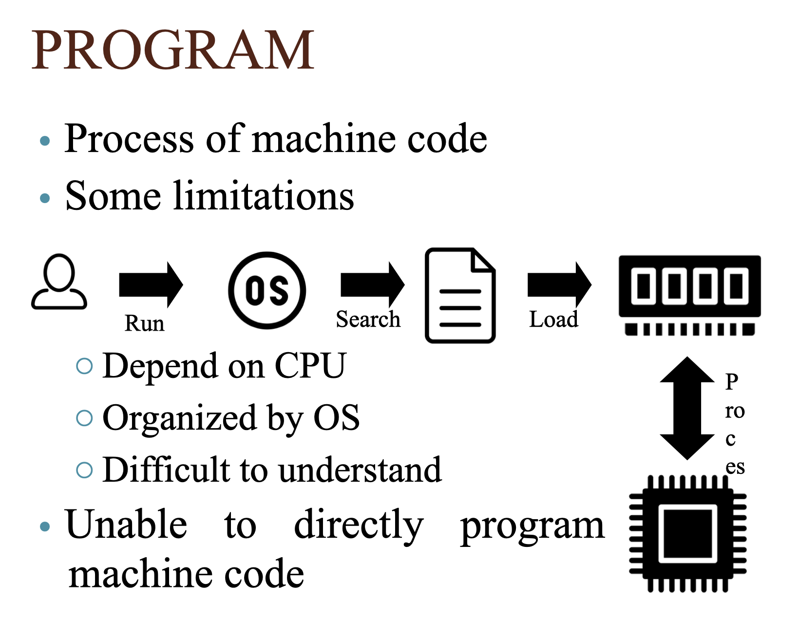

# MSc_S4_ProgrammingTechniques

## Intro.
- Làm bài tập nhóm hằng tuần - tối đa 2 bạn/nhóm
- Thi cá nhân: Trắc nghiệm - 80->100 câu
- Liên hệ với giảng viên qua moodle message (forum)
- Không cần làm đồ án

Có 10 buổi:
- 5 buổi cơ bản
- 5 buổi nâng cao

Môi trường lập trình cần đồng nhất để giảng viên dễ chấm bài:
- Visual Studio 2022

Mục đích:
- Cần nhanh -> dùng C/C++

Sách tham khảo (bắt buộc phải có):
- Nhập môn lập trình - Mr. Thư
- Kỹ thuật lập trình - Mr. Thư
- The C++ programming language - Bjame Stroustrup
- Intro. to algo - Thomas H.

Nội dung
- Tổng quan
- Toán tử cơ bản
- cấu trúc điều khiển - if else
- lập trình đơn thể - modular programming
- thuật toán cơ bản
- lập trình điều kiện
- mảng
- kỹ thuật loop
- struct - kiểu dữ liệu gộp
- xử lí file - text, binary

Program
- là tập hợp/chuỗi các chỉ dẫn
- để giải quyết một bài toán

Có 2 loại chương trình
- mã máy (machine code) (01)
- hợp ngữ (assembly, assembler) - thường dùng trong lập trình nhúng

Quá trình của mã máy:
người dùng -> run -> hệ điều hành -> tìm -> chương trình -> load -> ram -> xử lí -> chip
- tuỳ thuộc vào cpu
- tuỳ thuộc vào hệ điều hành
- khó hiểu

Hợp ngữ
- là ngôn ngữ lập trình cấp thấp
- dễ hiểu hơn mã máy
- cần trình biên dịch (assembler)
- phụ thuộc vào cpu
- tận dụng được kiến trúc cpu nhưng phải viết và dùng đúng cho cpu đó, loại khác thì phải viết lại

ngôn ngữ lập trình cấp cao truyền thống (C/C++)
- dễ hiểu hơn hợp ngữ
- tương thích tốt hơn
- trừu tượng hơn hợp ngữ
- viết một lần, dùng khác compiler để đọc cho các hệ điều hành khác nhau

Mục tiêu của các ngôn ngữ lập trình:
- hệ điều hành: C/C++
- máy học: python
- tính toán khoa học: fortran
- hệ thống quản lí: java, c#

ngôn ngữ lập trình cấp cao hiện đại (java)

code -> compiler -> byte-code -> virtual machine -> chip

- có xu hướng dịch ra byte-code

Compiler
- nhiệm vụ: biên dịch code và lưu kết quả đã biên dịch lên ổ cứng
- phải đủ code mới biên dịch dc

Interpreter
- trình thông dịch
- thông dịch từng dòng

C: .c -> compiler -> .o -> connect by linker
C++: .cpp -> compiler -> .obj -> connect by linker

IDE: Visual Studio 2022

Ví dụ:

%d gọi là mã định dạng

&a là địa chỉ của a

printf -> printf_s

scanf -> scanf_s

C: <math.h> -> dùng double (tập IR)

%lf là định dạng double

C++: <cmath>

Có thể lỗi do người dùng nhập b=0

Nộp file: TenHV1_TenHV2.cpp

COUT << "Hello World";
    - << là toán tử nhận 2 tham số:
        1. chuỗi (Hello World)
        2. COUT là biến, biến này kết nối với thiết bị xuất (ví dụ: màn hình) để đổ dữ liệu lên

Tương tự với CIN >> a;

\n: xuống dòng và thụt vào đầu dòng, tương tự với endl;

Kiểu dữ liệu

